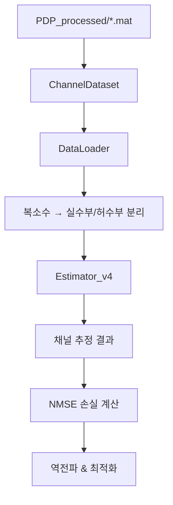
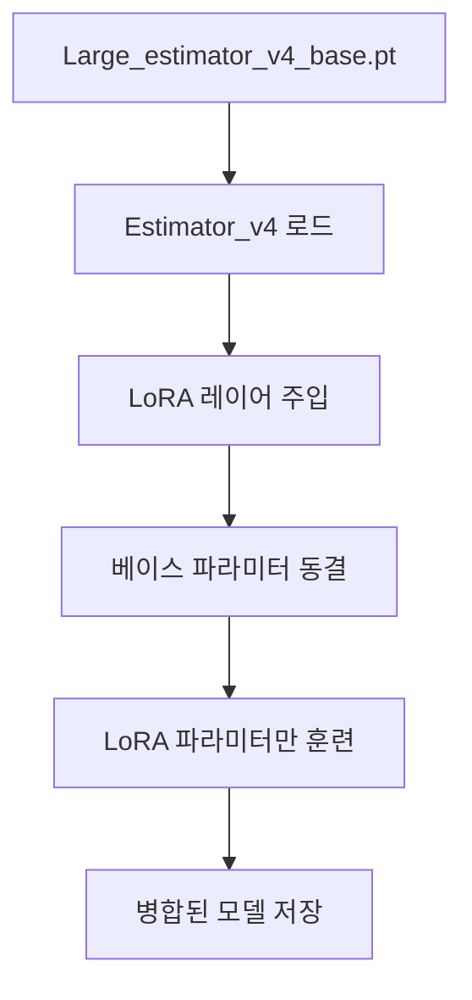
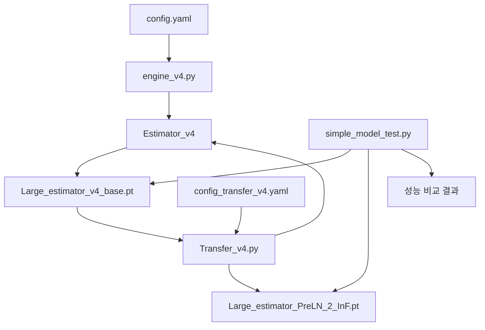

# 코드 아키텍처 상세 가이드

## 🏗️ 전체 시스템 아키텍처

```
DNN_channel_estimation_training/
├── 🎯 주요 실행 파일
│   ├── engine.py              # 기본 베이스 모델 훈련
│   ├── engine_v4.py           # v4 베이스 모델 훈련 (신규)
│   ├── Transfer_v4.py         # LoRA 전이학습
│   └── simple_model_test.py   # 성능 비교 테스트
├── 🧠 모델 아키텍처
│   ├── model/estimator.py     # 기본 채널 추정 모델
│   ├── model/estimator_v4.py  # v4 채널 추정 모델 (LoRA 대응)
│   ├── model/transformer.py   # 기본 Transformer
│   └── model/transformer_v4.py # v4 Transformer (분리된 projection)
├── ⚙️ 설정 파일
│   ├── config/config.yaml                 # 기본 모델 훈련 설정
│   ├── config/config_transfer_v4.yaml     # LoRA 전이학습 설정
│   ├── config/config_transfer_v4_InF.yaml # InF 특화 설정
│   └── config/config_transfer_v4_RMa.yaml # RMa 특화 설정
├── 📊 데이터 처리
│   ├── dataset.py             # 데이터셋 로더
│   └── dataset/PDP_processed/ # 전처리된 채널 데이터
└── 📋 문서화
    └── docs/                  # 기술 문서 모음
```

## 🔄 데이터 플로우

### 1. 훈련 데이터 플로우


### 2. 전이학습 플로우  


## 🧠 모델 아키텍처 비교

### Estimator vs Estimator_v4 구조 차이

#### Estimator (기본 모델)
```python
# 통합된 MultiheadAttention 사용
self.mha = MultiheadAttention(
    embed_dim=d_model, 
    num_heads=n_head,
    # 내부적으로 q,k,v projection 통합 관리
)
# 가중치 키: ch_tf._layers.0.mha.q_proj_weight
```

#### Estimator_v4 (LoRA 대응)
```python  
# 분리된 projection layers
self.mha_q_proj = Linear(d_model, d_model)  # Q projection
self.mha_k_proj = Linear(d_model, d_model)  # K projection  
self.mha_v_proj = Linear(d_model, d_model)  # V projection
self.mha = MultiheadAttention(...)          # 실제 attention 계산

# 가중치 키: ch_tf._layers.0.mha_q_proj.weight
```

### LoRA 타겟 모듈 매핑
```yaml
target_modules: [
  "mha_q_proj",     # Query projection
  "mha_k_proj",     # Key projection  
  "mha_v_proj",     # Value projection
  "out_proj",       # Output projection
  "ffnn_linear1",   # FFN 첫 번째 레이어
  "ffnn_linear2"    # FFN 두 번째 레이어
]
```

## ⚙️ 설정 시스템 구조

### config.yaml 계층 구조
```yaml
dataset:           # 데이터셋 관련 설정
  channel_type: [] # 사용할 채널 타입
  batch_size: 32   # 배치 크기
  # ... 기타 데이터 설정

training:          # 훈련 관련 설정  
  lr: 0.0001      # 학습률
  optimizer: Adam  # 옵티마이저
  device: cuda:0   # 디바이스
  # ... 기타 훈련 설정

ch_estimation:     # 모델 아키텍처 설정
  transformer:     # Transformer 구조
    num_layers: 4  # 레이어 수
    d_model: 128   # 모델 차원
    # ... 기타 모델 설정
  
  peft:           # LoRA 설정 (Transfer_v4.py 전용)
    r: 8          # LoRA rank
    lora_alpha: 8 # LoRA scaling
    # ... 기타 LoRA 설정
```

## 🔧 핵심 클래스 구조

### Engine_v4 클래스
```python
class Engine_v4:
    def __init__(self, conf_file):
        # 설정 로드 & 환경 초기화
        self._conf = yaml.safe_load(conf_file)
        self._device = self._conf['training']['device']
        
        # 모델 & 데이터 초기화
        self._estimator = Estimator_v4(conf_file)
        self._dataset, self._dataloader = get_dataset_and_dataloader()
        
        # 옵티마이저 설정
        self.set_optimizer()
    
    def set_optimizer(self):
        # 설정 기반 옵티마이저 선택
        optimizer_type = self._conf['training']['optimizer']
        # Adam/AdamW/SGD 지원
        
    def train(self):
        # 메인 훈련 루프
        for it, data in enumerate(self._dataloader):
            # Forward pass
            ch_est, _ = self._estimator(rx_signal)
            
            # Loss 계산 (NMSE)
            ch_loss = self.calculate_nmse_loss(ch_est, ch_true)
            
            # Backward pass & 최적화
            self._ch_optimizer.zero_grad()
            ch_loss.backward()
            self._ch_optimizer.step()
```

### TransferLearningEngine 클래스 (Transfer_v4.py)
```python
class TransferLearningEngine:
    def load_model(self):
        # v4 베이스 모델 로드
        self._estimator = Estimator_v4(self._conf_file)
        
        # LoRA 설정 적용
        lora_config = LoraConfig(r=8, lora_alpha=8, ...)
        self._estimator = get_peft_model(self._estimator, lora_config)
        
    def save_combined_model_as_pt(self):
        # LoRA 가중치를 베이스 모델에 병합
        merged_model = self._estimator.merge_and_unload()
        
        # engine.py 호환 형태로 변환 후 저장
        torch.save(merged_model, save_path)
```

## 🔄 상호 의존성 그래프



## ⚡ 성능 최적화 포인트

### 1. 메모리 최적화
```python
# 그래디언트 체크포인팅
torch.utils.checkpoint.checkpoint(layer, input)

# Mixed Precision 훈련
from torch.cuda.amp import autocast, GradScaler
scaler = GradScaler()
```

### 2. 계산 최적화
```python
# 효율적인 어텐션 계산
torch.nn.functional.scaled_dot_product_attention()

# 컴파일 최적화 (PyTorch 2.0+)
model = torch.compile(model)
```

### 3. I/O 최적화
```python
# 데이터 로더 멀티 프로세싱
DataLoader(dataset, num_workers=4, pin_memory=True)

# 비동기 데이터 전송
data = data.to(device, non_blocking=True)
```

## 🐛 디버깅 가이드

### 일반적인 문제들

#### 1. CUDA 메모리 부족
```python
# 배치 크기 줄이기
batch_size: 16  # 32 → 16

# 그래디언트 누적 사용
if (step + 1) % accumulation_steps == 0:
    optimizer.step()
    optimizer.zero_grad()
```

#### 2. 가중치 로드 실패
```python
# strict=False 대신 키 매핑 확인
missing_keys, unexpected_keys = model.load_state_dict(state_dict, strict=False)
print(f"Missing: {missing_keys}")
print(f"Unexpected: {unexpected_keys}")
```

#### 3. LoRA 파라미터 동결 문제
```python
# 학습 가능한 파라미터 확인
trainable_params = [p for p in model.parameters() if p.requires_grad]
print(f"Trainable parameters: {len(trainable_params)}")
```

## 🚀 확장성 고려사항

### 1. 멀티 GPU 지원
```python
# DataParallel 또는 DistributedDataParallel
model = torch.nn.DataParallel(model)
# 또는
model = torch.nn.parallel.DistributedDataParallel(model)
```

### 2. 동적 LoRA 랭크
```python
# 레이어별 다른 LoRA 랭크 적용
target_modules_config = {
    "mha_q_proj": {"r": 8},
    "mha_k_proj": {"r": 4}, 
    "ffnn_linear1": {"r": 16}
}
```

### 3. 실험 관리
```python
# Hydra를 통한 구조화된 설정 관리
@hydra.main(config_path="config", config_name="config")
def main(cfg: DictConfig):
    engine = Engine_v4(cfg)
```

이 아키텍처 가이드를 통해 코드의 전체적인 구조와 각 컴포넌트 간의 관계를 이해할 수 있습니다.